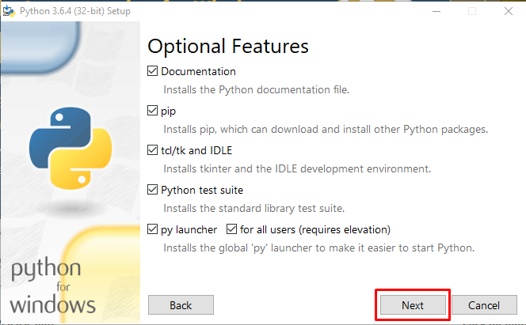

# How to Verify your Ledger Hardware Wallet is Genuine on a Windows PC

The Secure Element within the Ledger Nano S is personalized during assembly with an attestation proving that it has been manufactured by Ledger. By using the verification tool provided by Ledger ([Here](https://ledger.zendesk.com/hc/en-us/articles/115005321449-How-to-verify-the-security-integrity-of-my-Nano-S)) you can confirm that the ledger you are using is a genuine Ledger device that has not been tampered with. 

However, using the utility can be very challenging for some and Ledger has not provided any instructions for installing the required tools to run the utility in a Windows environment. This is our best attempt at guiding you through each step required to run the Ledger verification on a Windows PC. 

### 1. [Download & Install Python 3.6.4](https://www.python.org/downloads/)
* Right click on installer and "Run as Administrator"  

   
* Select "Add Python 3.6 to PATH"  

* Choose "Custom Installation"
     

* Click "Next"  

   
* Customize install location and set to your root directory (C:\Python36-32)  

* Click Install  

   

### 2. [Download and save the Ledger Utility to your Python Installation Path](https://raw.githubusercontent.com/LedgerHQ/blue-loader-python/master/ledgerblue/checkGenuine.py)  


### 3. [Download and install Visual C++ 2015 Build Tools](http://landinghub.visualstudio.com/visual-cpp-build-tools)


### 4. Search for "cmd" in Windows. Right click on Command Prompt and "Run as Administrator"  

### 5. Navigate to the Visual Studio \VC directory
```cd C:\Program Files (x86)\Microsoft Visual Studio 14.0\VC```  


### 6. Run vcvarsall.bat
``` vcvarsall.bat```  


### 7. set CL=-FI"%VCINSTALLDIR%\INCLUDE\stdint.h
```set CL=-FI"%VCINSTALLDIR%\INCLUDE\stdint.h```  


### 8. Install pycrypto with pip.
```pip install pycrypto```  


### 9. Navigate to the Python installation path
 ```cd C:\Python36-32```  


### 10. Install ledgerblue with your open command prompt: 
```pip install --no-cache-dir ledgerblue```  


### 11. Connect your Ledger Nano S to your PC and enter your pin to unlock your Ledger. 

### 12. Run the verification utility in your Command Prompt. On your Ledger device, press the right button to "allow unknown manager" 
```python -m ledgerblue.checkGenuine --targetId 0x31100002```  


